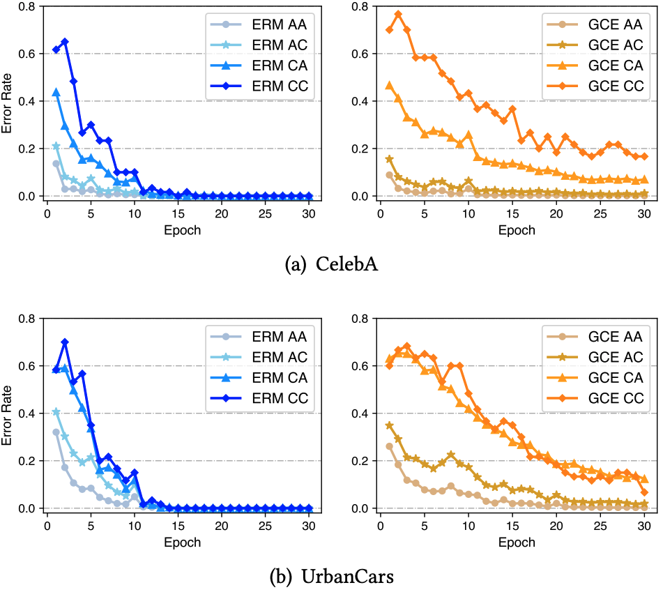
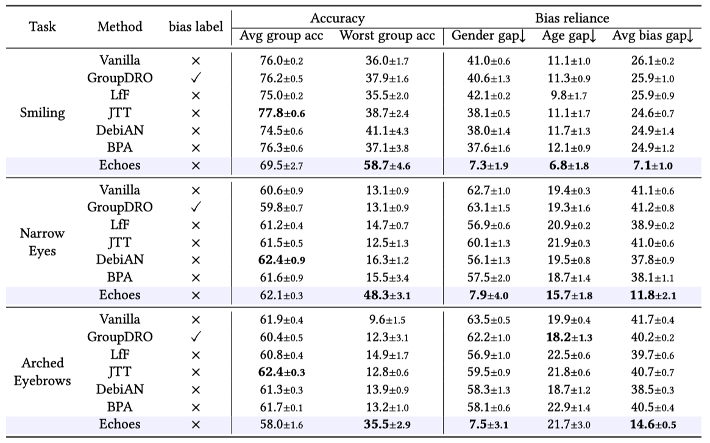

# **Echoes: Unsupervised Debiasing via Pseudo-bias Labeling in an Echo Chamber**

| Rui Hu$^1$ $\quad \quad\quad$ Yahan Tu$^2$ $\quad \quad\quad$ Jitao Sang$^{1,3}$ |
| :----------------------------------------------------------: |
| $^1$Beijing Jiaotong University  $\quad \quad\quad$ $^2$China University of Geoscience Beijing $\quad \quad\quad$  $^3$Peng Cheng Lab |
|                  ***ACM Multimedia 2023***                   |
| <a href="https://arxiv.org/abs/2305.04043">Arxiv</a> \| <a href="https://github.com/isruihu/Echoes">Code</a> \|  <a href="./resources/bibtex.txt">Bibtex</a> |

## Background

Recent studies have revealed that many models have a tendency to learn shortcut cues (i.e., bias). Since accessing bias information in the training phase is labor-intensive, recent works focus on the more challenging and realistic task - unsupervised debiasing, which mitigates the bias without annotation.

Unsupervised debiasing methods work with the assumption that biased features are easier to be learned than target features. Following this assumption, the works typically train two models: one is an auxiliary biased model specialized to learn biased features so that the predictions of the biased model can be used as pseudo-bias labels, i.e., whether a sample is bias-aligned or bias-conflicting. And the other is the desired target model that using pseudo-bias labels from the biased model for debiasing.

## Motivation

Howerver, our experimental analysis reveals that existing bias models, e.g., an ERM model or a GCE model, fail to provide accurate pseudo-bias labels, i.e., unable to identify bias-conflicting samples in the training data. Due to the scarcity of the bias-conflicting samples, the biased models are prone to memorize these samples to minimize the training loss, leading to the overfitting on them. For example, the error rate of an ERM model on the bias-conflicting sample (AC, CA and CC) of CelebA  is close to zero at the end of training. This, in turn, negatively impacts the debiasing performance of the target modes.

## Method

To address the problem, we propose a simple and effective unsupervised debiasing method called Echoes (Echo chamber for debiasing) which trains a biased model and a target model in an echo chamber. Unlike the training of existing biased model, we are inspired by the Echo chamber phenomenon in media communication, and continually adjust the weights of the samples during the training phase like the information changing in an echo chamber, so that the biased model can distinguish bias-conflicting samples from bias-aligned ones. Specifically, we consider that in the early training phase, the majority of samples correctly classified by the biased model are biasaligned, while the samples misclassified by the model consist of a minority of bias-aligned samples and a majority of bias-conflicting ones. Then we can "hide" these error samples by reducing their weights. The remaining samples that are correctly classified by the biased model will be retrained in the next training round, just like the echo in an echo chamber. In the end, the biased model sufficiently learns from bias-aligned samples, while underfitting for bias-conflicting ones, which indicates that more accurate bias information can be provided to the target model.

In the echo chamber, a lower sample weight indicates that it is more often misclassified by the biased model, and a higher weight indicates that it is more often correctly classified. This means that samples with lower weights are harder to be learned by the biased model, making them more important for the target model. Based on this analysis, we simply use the inverse of the biased model’s sample weights as the target model’s sample weights, so that the target model can focus on learning hard samples to prevent learning spurious correlations.

## Result

On CelebA dataset, our method achieves the best worst group accuracy and average bias gap on all three tasks. The average group accuracy of our method is relatively low, but the worst group accuracy is high, which indicates that the accuracy of different groups is close, and this also reflects the debiasing performance of our method.

Please refer to our paper for more experimental results.